  

<i>Turning ideas into code and continuously learning through real-world projects.</i>

 

 

## 👩‍💻 About Me

I'm a Computer Science & Engineering student at **MITE**, graduating in 2027, passionate about full-stack development and exploring AI & data. I enjoy solving problems through code and I'm always learning something new by building it.

 

## 🚀 Currently Exploring

`Full-Stack Development` &nbsp;•&nbsp; `React.js` &nbsp;•&nbsp; `Node.js` &nbsp;•&nbsp; `REST APIs` &nbsp;•&nbsp; `Java & DSA` &nbsp;•&nbsp; `AI / Data Analysis` &nbsp;•&nbsp; `Database Systems` &nbsp;•&nbsp; `IoT`

 

## 🛠️ Tech Stack

**Languages**
 

  

**Frontend**
 

  

**Backend**
 

  

**Databases**
 

  

**Tools**
 
 &nbsp;   

 

## 💡 Developer Interests

<table align="center">
<tr>
<td align="center" width="200">💻 <b>Full-Stack Development</b></td>
<td align="center" width="200">🤖 <b>AI & Intelligent Applications</b></td>
</tr>
<tr>
<td align="center" width="200">📊 <b>Data & Visualization</b></td>
<td align="center" width="200">🧠 <b>DSA & Problem Solving</b></td>
</tr>
<tr>
<td align="center" width="200">🌐 <b>Open Source</b></td>
<td align="center" width="200">🔌 <b>IoT & Smart Systems</b></td>
</tr>
</table>

 

## 🏆 Achievements

-  **Winner** - Web KOBO, AAKAR'26
-  **Top 20 Finalist** - Unisys Innovation Program 2026
-  **Top 5** - Ladder1 Coding Challenge
-  **Rank 429** - CodeClash All India Coding Challenge
-  **GSSOC 2025** Contributor
-  **Hacktoberfest 2025** Super Contributor

 

## Leadership

**Vice President** - CORE, CSE Department, MITE
&nbsp;•&nbsp;
**Technical Head** - DEVStudio Full Stack Club, MITE

 

##  GitHub Analytics

 

 

## 🐍 Contribution Activity

  <picture>
    <source
      media="(prefers-color-scheme: dark)"
      srcset="https://raw.githubusercontent.com/namitanaik07/namitanaik07/output/github-snake-dark.svg"
    />
    <source
      media="(prefers-color-scheme: light)"
      srcset="https://raw.githubusercontent.com/namitanaik07/namitanaik07/output/github-snake.svg"
    />
    
  </picture>

 

## 🤝 Let's Connect

  

  

<i>Building. Learning. Solving. Shipping. 🚀</i>
 
<i>Let's connect and build something meaningful.</i>

